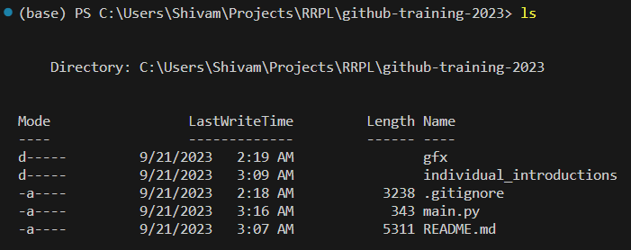
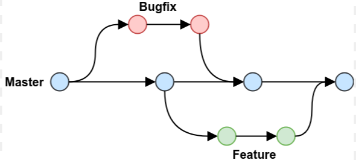
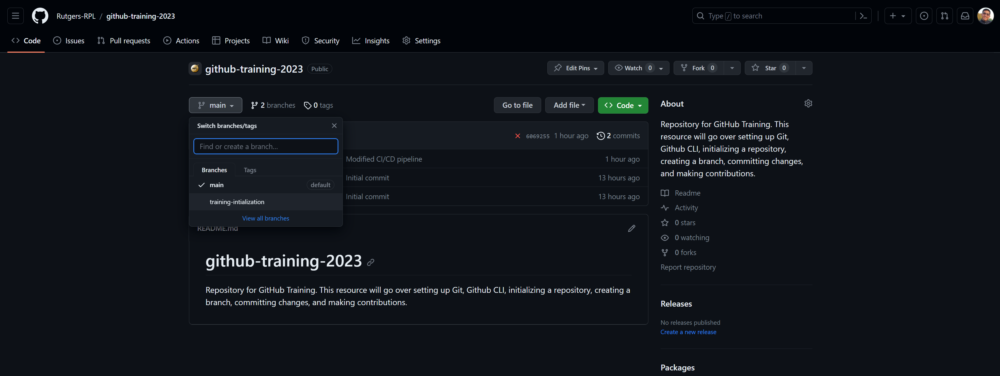
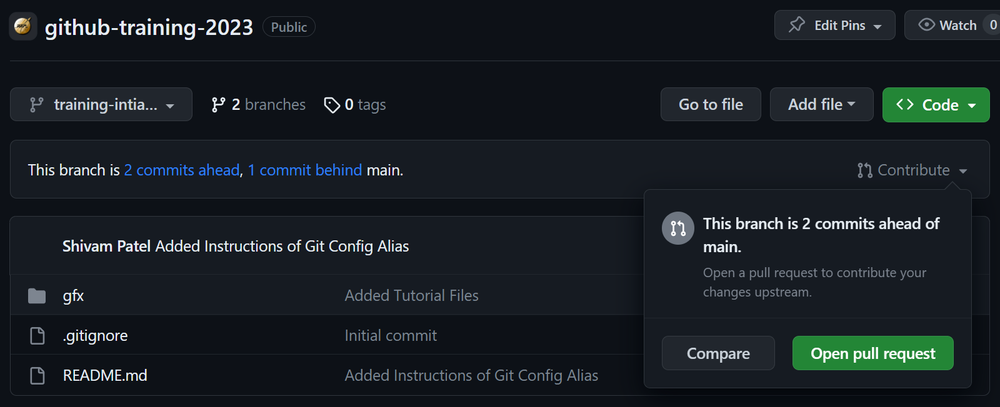
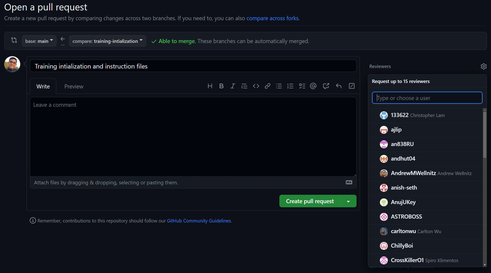

# github-training-2023

Welcome to the 2023 AIAA GitHub Training! This exercise will go over setting up Git, Github CLI, initializing a repository, creating a branch, committing changes, and making contributions. Feel free to reach out to Shivam Patel ([@shivammpat](https://github.com/shivammpat)) if you have any issues!

We tried to make this training as foundational as possible, but you may need to brush up on your Python and Terminal skills. That said, I strongly discourage consulting tools like ChatGPT or Bard. They will happily generate problematic garbage that will make completing this exercise harder than it needs to be.

## Getting Started

 1. Install [Git](https://github.com/git-guides/install-git) and [GitHub Command Line Interface (CLI)](https://cli.github.com/). Use the linked  guides to complete  the installation process. You can also use a package manager such as [Homebrew](https://brew.sh/) for macOS, [Chocolatey](https://chocolatey.org/) for Windows, or even [APT][https://wiki.debian.org/Apt]/[DNF](https://docs.fedoraproject.org/en-US/quick-docs/dnf/) for Linux. 
 
 2. Register for a [GitHub Account](https://github.com/join). You are encouraged, but **not** required, to set up 2-Factor Authentication.
 
 3. Setup GitHub CLI Authentication. Use the provided [Quickstart Guide](https://docs.github.com/en/github-cli/github-cli/quickstart). Choose to login to Github.com and HTTPS instead of SSH as your preferred connection protocol. Choose to login using a web browser rather than a token.
   
 4. Setup your Git configuration name in and email. Use any name and email your comfortable with, but we'd prefer something identifiably yours.

    ```Shell
    git config --global user.email "your.email@rutgers.edu"
    git config --global user.name "Your Name"
    ```

 5. Once you have successfully installed Git and GitHub CLI, run the following terminal commands to verify your installation.

    ```Shell
    git --version
    gh auth status
    ```

 6. Discord DM a screen grab of the output of those commands to Shivam Patel (techy_clodhopper). It should look something like the following.
   
    

 7. If your installation is done correctly, you will be invited to join the Rutgers RPL GitHub Organization. Accept the invitation sent to the email associated with your GitHub Account.

## Part 1: Cloning & Branching

1. Now that you have Git and GitHub set up on your device, it's time to grab a hold of the files needed to actually complete the training. The code is stored in the cloud in a strucure called a *repository,* basically it's a special type of folder that stores all of your code and some additonal information so that Git can track changes. In this case, the repository is called [github-training-2023](https://github.com/Rutgers-RPL/github-training-2023). (You'll see that spaces are replaced with '-' or '_' in many places. It often helps to have names be one long word rather than many!)
   
2. Navigate to whatever folder on your machine that you'd like to do RRPL coding projects in. You can even create a new folder. As an aside, the terms "folder" and "directory" mean the same thing. Open a terminal in this directory.

   ```Shell
   cd C:\Users\Shivam\Projects\
   mkdir RRPL
   cd RRPL
   ```

3. The process of accessing the code stored on the cloud and putting it on your device is called *cloning.* Unlike other cloud tools like Google Drive or Microsoft OneDrive, the files in your workspace are not automatically synced with the remote (cloud) ones. So, when you download the code on you machine, your actually downloading a *copy* of the code you see online (hence, cloning). Let's clone our repository. You can clone using three different methods: HTTPS, SSH, or the GitHub CLI. In most cases, you'll want to use HTTPS or the GH CLI.   
   
   ```Shell
   gh repo clone Rutgers-RPL/github-training-2023
   ```

   Note the different parts of the command above. First, we tell the terminal to use the `gh` (GitHub) executable. Then, we specify that we're going to perform some `repo`(sitory) operation, in this case `clone`. Then, we specify what were trying to clone. Here, notice that `Rutgers-RPL` is the owner of the repository and `github-training-2023` is the specific repository we're trying to clone.

4. You can use the `ls` command to see that you've successfully cloned the `github-training-2023` repository. Here are some rather useful commands.

   ```Shell
   cd new_dir        # change current directory to "new_dir"
   pwd               # prints the name of the current directory
   ls                # lists all files in the current directory
   mkdir new_dir     # make a new directory called "new_dir"
   cp src dest       # copy file src to file dest
   mv src dest       # move the file at src to dest
   rm file           # removes file
   touch your_file   # creates a new empty file called "file" (Linux Only)
   ```

5. Now, that you've successfully cloned the repository. Navigate into it using `cd github-training-2023`. Using the `ls` command, you can see all of the files and folders you cloned from the remote repository. It should look something like this.

   

6. Great, now we can move on to *branches*. Git is powerful because it does more than enable remote storage. Git is a **V**ersion **C**ontrol **S**ystem, meaning that it's a powerful tool that helps us track and control complex series of changes in an orderly way. Crucially, it allows us to bundle changes into snapshots called branches. Think of it sort of like making a copy of our code to try out experimental changes without the risk of breaking the main version of the codebase. When we're satisfied with our changes, we can *merge* all our accumulated changes into our main codebase using a **pull request**. Here is a helpful diagram.

   

   **Remember:** Git doesn't track files, it tracks *changes*. So, if your digital chain of changes ever gets broken, you'll likely run into big problems. 

7. To create a new branch, we can use the `git checkout` command.

   ```Shell
   git checkout -b "first-last-github-training"
   ```

   Here, we use the `-b` flag to tell Git that we want to create a new branch and give it a specific name. The checkout command also switches you to this new command. Substitute your actual first and last name when you create your own branch. To check if you did things correctly, you can use the `git branch` command. Your new branch should appear with an asterisk (*) next to it.

8. Good work! You've now created a new branch on your local machine. Your branch currently only exists in the context of your workspace, nowhere else. Remember this. It'll be important later.

## Part 2: Making Changes

1. Wonderful! You've successfully set up your version control and organized your working environment to make your contribution. Normally, this will take up the *vast* majority of your time, but this time it will be very quick.

2. Create a file in the `individual_introductions` directory called `first_last.py` (use your actual name here too). This is where you'll tell us about yourself. Open the file in a text editor such as [Sublime Text](https://www.sublimetext.com/) or an IDE like [VSCode](https://code.visualstudio.com/). Create a function called `intro()` and write! Feel free to be as creative as you'd like. We'll write some code to display your words next. 

   Here is what my introduction file looks like: 

   ```Python
   def intro():
    print('Hi! My name is Shivam Patel. I\'m a 3rd year Computer Science and Economics major.' + 
          '\nI\'ve been a part of AIAA and RPL since I was a freshman. It\'s my second year serving you all as a team lead. ' + 
          '\nI\'m always open to talk and I really want to make sure everyone feels welcome to be their best on our team.\n')
   ```

   You don't *have* to be as verbose, but I certainly encourage it! Just remember to end your introduction with a `'\n'` to help with formatting.

3. Now lets change attention to the `main.py` file. Here we're going to write the code to display your introduction. 

   1. Follow the pattern and import your introduction from all of the individual introductions at the top of the file

      ```Python
      from individual_introductions import first_last
      ```

   2. Call your `intro()` function in the main function.

      ```Python
      def main():
         # other intros
         first_last.intro()
      ```

   3. (Optional) You can test our code by calling `python main.py` in the repository directory.

## Committing, Pushing, and Merging Changes

1. We're almost over the finish line. Now, we need to tell Git what files we want it to include in the commit. A commit is a snapshot of a bundle of changes. We can do this by using the `git add` command. We need to add all the files we want to include, everytime we commit.

   ``` Shell
   git add main.py
   git add ./individual_introductions/first_last.py
   ```

   You can see that your changes are ready to be included in the next commit by using the `git status` command. You should see that your desired files are in the "Changes to be committed:" section.

2. Now, let's take a snapshot of our work by *committing* our changes. This will take a snapshot of the current state of all of our added files and bundle them together.

   ```Shell
   git commit -m "GitHub Training Additions & Changes"
   ```

   Commit messages (denoted by the `-m` flag) are a required part of making commits. They should be insightful and give a brief overview of what changes the commit contains. Commit messages should never exceed 50 characters.

   Calling `git status` now will now show that there are no changes to be commited. On the other hand, the `git log` will show that we have added a commit to our repository.

3. Finally, we need to send our changes back up into the cloud. We do that by performing a `git push`. If this is the first push you make on your current branch, you'll need to specify a destination to send your changes in the cloud. This is done by using the `--set-upstream` flag. If the branch doesn't already exist in the cloud, Git will automatically create it.

   ```Shell
   git push --set-upstream origin "your-branch-name"
   ```

4. We're now done with the local part of the training. Now, we need to go online in order to merge our changes into the main branch of code. In most team repositories, the main branch will be protected, meaning that is always in a functional state. Thus, we need to create a `pull request` in order to have our changes considered for merging. If the changes are approved, the branches will be merged and the changes will be pulled over into main.
   
   1. Login to GitHub in another tab. Navigate to the [repository page](https://github.com/Rutgers-RPL/github-training-2023).

   2. Click on the branches drop down and select your branch.  

      

   3. Click on the contribute button. Open a pull request.
   
      

   4. Write a brief description of your work and select Shivam Patel (@shivammpat) as you reviewer.

      

5. That's it! If you did everything correctly, a team lead will review your pull request and merge your changes into the main branch. When that happens, you're all done. Congratulations and welcome aboard!