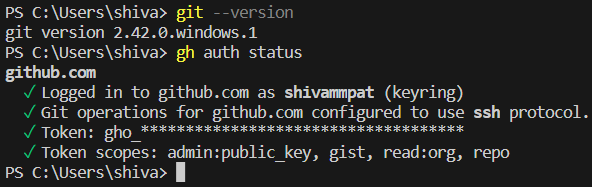

# github-training-2023

Welcome to the 2023 AIAA GitHub Training! This exercise will go over setting up Git, Github CLI, initializing a repository, creating a branch, committing changes, and making contributions. Feel free to reach out to Shivam Patel ([@shivammpat](https://github.com/shivammpat)) if you have any issues!

## Getting Started

 1. Install [Git](https://github.com/git-guides/install-git) and [GitHub CLI](https://cli.github.com/). Use the linked  guides to complete  the installation process.
 2. Register for a [GitHub Account](https://github.com/join). You are encouraged, but **not** required, to set up 2-Factor Authentication.
 3. Setup GitHub CLI Authentication. Use the provided [Quickstart Guide](https://docs.github.com/en/github-cli/github-cli/quickstart). Choose HTTPS instead of SSH as your preferred connection protocol.
 4. Setup your Git configuration name in and email. Use any name and email your comfortable with, but we'd prefer something identifiably yours.

   ```Shell
   git config --global user.email "your.email@rutgers.edu"
   git config --global user.name "Your Name"
   ```

 5. Once you have successfully installed Git and GitHub CLI, run the following terminal commands to verify your installation.

    ```Shell
    git --version
    gh auth status
    ```

 6. Discord DM a screen grab of the output of those commands to Shivam Patel (techy_clodhopper). It should look something like the following.
    
 7. If your installation is done correctly, you will be invited to join the Rutgers RPL GitHub Organization. Accept the invitation sent to the email associated with your GitHub Account.

## Part 1: Cloning & Branching

1. Now that you have Git and GitHub set up on your device, it's time to grab a hold of the files needed to actually complete the training. The code is stored in the cloud in a strucure called a *repository,* basically it's a special type of folder that stores all of your code and some additonal information so that Git can track changes. In this case, the repository is called [github-training-2023](https://github.com/Rutgers-RPL/github-training-2023).
2. The process of accessing the code stored on the cloud and putting it on your device is called *cloning.* Unlike other cloud tools like Google Drive or Microsoft OneDrive, the files in your workspace are not automatically synced with the remote ones.
